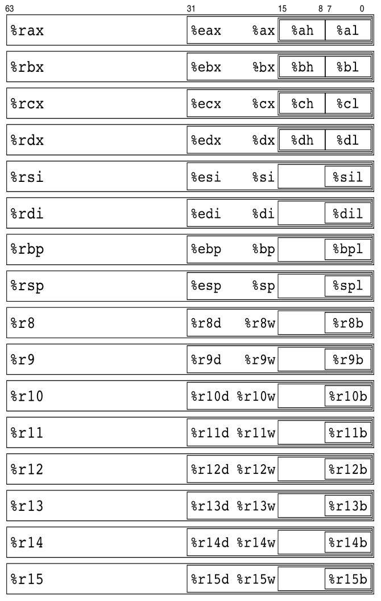

# Part 7：比较运算符

接下来我打算添加 IF 语句，但是后来我意识到我最好先添加一些比较运算符。结果证明这是相当容易的，因为它们和现有的运算符一样都是二元运算符。

让我们快速了解添加六个比较运算符的变化：`==`、`!=`、`<`、`>`、`<=` 和 `>=`。

## 添加新 token

我们将有 6 个新的 token，所以让我们把它们添加到 `def.h`：

```c
// Token types
enum {
  T_EOF,
  T_PLUS, T_MINUS,
  T_STAR, T_SLASH,
  T_EQ, T_NE,
  T_LT, T_GT, T_LE, T_GE,
  T_INTLIT, T_SEMI, T_ASSIGN, T_IDENT,
  // Keywords
  T_PRINT, T_INT
};
```

我重新排列了 token，使具有优先权的 token 从低到高依次出现在没有任何优先权的 token 之前。

## 扫描 token

现在我们必须扫描它们。注意，我们必须区分 `=` 和 `==`、`<` 和 `<=`、`>` 和 `>=`。因此，我们需要从输入中读入一个额外的字符，如果不需要，就把它放回去。以下是 `scan.c` 中 `scan()` 中的新代码：

```c
  case '=':
    if ((c = next()) == '=') {
      t->token = T_EQ;
    } else {
      putback(c);
      t->token = T_ASSIGN;
    }
    break;
  case '!':
    if ((c = next()) == '=') {
      t->token = T_NE;
    } else {
      fatalc("Unrecognised character", c);
    }
    break;
  case '<':
    if ((c = next()) == '=') {
      t->token = T_LE;
    } else {
      putback(c);
      t->token = T_LT;
    }
    break;
  case '>':
    if ((c = next()) == '=') {
      t->token = T_GE;
    } else {
      putback(c);
      t->token = T_GT;
    }
    break;
```

我还将 `=` 标记的名称更改为 T_ASSIGN，以确保不会混淆它和新的 T_EQ 标记。

## 新的表达式代码

我们现在可以扫描 6 个新 token。因此，现在我们必须在表达式中出现它们时解析它们，并强制它们的运算符优先级。

到现在为止，你应该已经知道：

- 我正在构建一个可以自编译的编译器
- 用 C 语言
- 使用 SubC 编译器作为参考。

这意味着我正在为 C 的一个子集编写一个编译器（就像 SubC 一样），以便它能够编译它自己（compile itself）。因此，我应该使用正常的 C 运算符优先级。这意味着比较运算符的优先级低于乘除运算符。

我还意识到，我用来将 token 映射到 AST 节点类型的 switch 语句只会越来越大。所以我决定重新排列 AST 节点类型，以便所有二元运算符之间有一个 1:1 的映射（在 `def.h` 中）：

```c
// AST node types. The first few line up
// with the related tokens
enum {
  A_ADD=1, A_SUBTRACT, A_MULTIPLY, A_DIVIDE,
  A_EQ, A_NE, A_LT, A_GT, A_LE, A_GE,
  A_INTLIT,
  A_IDENT, A_LVIDENT, A_ASSIGN
};
```

现在在 `expr.c` 中，我可以简化 token 到 AST 节点的转换，并添加新的 token 的优先级：

```c
// Convert a binary operator token into an AST operation.
// We rely on a 1:1 mapping from token to AST operation
static int arithop(int tokentype) {
  if (tokentype > T_EOF && tokentype < T_INTLIT)
    return(tokentype);
  fatald("Syntax error, token", tokentype);
}

// Operator precedence for each token. Must
// match up with the order of tokens in defs.h
static int OpPrec[] = {
  0, 10, 10,                    // T_EOF, T_PLUS, T_MINUS
  20, 20,                       // T_STAR, T_SLASH
  30, 30,                       // T_EQ, T_NE
  40, 40, 40, 40                // T_LT, T_GT, T_LE, T_GE
};
```

这就是解析和运算符优先级的内容！

## 代码生成

由于这六个新的运算符都是二元运算符，所以很容易修改 `gen.c` 中的通用代码生成器来处理它们：

```c
  case A_EQ:
    return (cgequal(leftreg, rightreg));
  case A_NE:
    return (cgnotequal(leftreg, rightreg));
  case A_LT:
    return (cglessthan(leftreg, rightreg));
  case A_GT:
    return (cggreaterthan(leftreg, rightreg));
  case A_LE:
    return (cglessequal(leftreg, rightreg));
  case A_GE:
    return (cggreaterequal(leftreg, rightreg));
```

## x86-64 代码生成

现在有点棘手了。在 C 语言中，比较运算符返回一个值。如果它们的值为 true，则结果为 1。如果它们的值为 false，则结果为 0。我们需要编写 x86-64 汇编代码来反映这一点。

幸运的是，有一些 x86-64 指令可以做到这一点。不幸的是，在这个过程中有一些问题需要处理。考虑以下 x86-64 指令:

```c
    cmpq %r8,%r9
```

上面的 cmpq 指令执行 %r9 - %r8 并设置几个状态标志，包括负标志和零标志。因此，我们可以通过标志组合来查看比较结果：

| 比较       | 操作      | 如果为 true 时的标志   |
| ---------- | --------- | ---------------------- |
| %r8 == %r9 | %r9 - %r8 | Zero                   |
| %r8 != %r9 | %r9 - %r8 | Not Zero               |
| %r8 > %r9  | %r9 - %r8 | Not Zero, Negative     |
| %r8 < %r9  | %r9 - %r8 | Not Zero, Not Negative |
| %r8 >= %r9 | %r9 - %r8 | Zero or Negative       |
| %r8 <= %r9 | %r9 - %r8 | Zero or Not Negative   |

有六个 x86-64 指令：set、setne、set、setl、setge 和 set，它们根据两个标志值并按照上述表行的顺序将寄存器设置为 1 或 0。

问题是，这些指令只设置寄存器的最低字节。如果寄存器已经在最低字节之外设置了位，它们将保持原有的设置。因此，我们可以将一个变量设置为 1，但如果它已经有了值 1000（十进制），那么它现在将是 1001，这不是我们想要的。

解决方案是在 `setX` 指令之后对寄存器进行 `andq`，以去除不需要的位。在 `cg.c` 中，有一个通用的比较函数可以做到这一点：

```c
// Compare two registers.
static int cgcompare(int r1, int r2, char *how) {
  fprintf(Outfile, "\tcmpq\t%s, %s\n", reglist[r2], reglist[r1]);
  fprintf(Outfile, "\t%s\t%s\n", how, breglist[r2]);
  fprintf(Outfile, "\tandq\t$255,%s\n", reglist[r2]);
  free_register(r1);
  return (r2);
}
```

其中 `how` 是 `setX` 指令之一。注意，我们执行：

```c
   cmpq reglist[r2], reglist[r1]
```

因为这实际上是 `reglist[r1] - reglist[r2]`，这是我们真正想要的。

## x86-64 寄存器

我们需要在这里稍微转移一下话题，讨论一下 x86-64 体系结构中的寄存器。x86-64 有几个 64 位通用寄存器，但是我们也可以使用不同的寄存器名来访问和处理这些寄存器的子部分。



上面来自 [Notes on x86-64 programming](https://www.lri.fr/~filliatr/ens/compil/x86-64.pdf) 的图片表明，对于 64 位 r8 寄存器，我们可以通过使用 "r8d" 寄存器访问该寄存器的低 32 位。类似地，"r8w" 寄存器是 r8 寄存器的低 16 位，"r8b" 寄存器是 r8 寄存器的低 8 位。

在 `cgcompare()` 函数中，代码使用 `reglist[]` 数组来比较两个64位寄存器，然后使用 `breglist[]` 数组中的名称在第二个寄存器的 `8` 位版本中设置一个标志。x86-64 体系结构只允许setX 指令对 8 位寄存器名（即`breglist[]` 数组中相应的名称）进行操作，因此需要 `breglist[]` 数组。

## 创建多个比较指令

现在我们有了这个通用函数，我们可以编写六个实际的比较函数：

```c
int cgequal(int r1, int r2) { return(cgcompare(r1, r2, "sete")); }
int cgnotequal(int r1, int r2) { return(cgcompare(r1, r2, "setne")); }
int cglessthan(int r1, int r2) { return(cgcompare(r1, r2, "setl")); }
int cggreaterthan(int r1, int r2) { return(cgcompare(r1, r2, "setg")); }
int cglessequal(int r1, int r2) { return(cgcompare(r1, r2, "setle")); }
int cggreaterequal(int r1, int r2) { return(cgcompare(r1, r2, "setge")); }
```

与其他二元运算符函数一样，一个寄存器被释放，另一个寄存器返回结果。

## 试一下

看看 `input04` 输入文件：

```c
int x;
x= 7 < 9;  print x;
x= 7 <= 9; print x;
x= 7 != 9; print x;
x= 7 == 7; print x;
x= 7 >= 7; print x;
x= 7 <= 7; print x;
x= 9 > 7;  print x;
x= 9 >= 7; print x;
x= 9 != 7; print x;
```

所有这些比较都是 `true`，所以我们应该打印 9 个 1。执行 `make test` 来确认这一点。

让我们通过第一次比较来查看汇编代码输出：

```assembly
        movq    $7, %r8
        movq    $9, %r9
        cmpq    %r9, %r8        # Perform %r8 - %r9, i.e. 7 - 9
        setl    %r9b            # Set %r9b to 1 if 7 is less than 9
        andq    $255,%r9        # Remove all other bits in %r9
        movq    %r9, x(%rip)    # Save the result in x
        movq    x(%rip), %r8
        movq    %r8, %rdi
        call    printint        # Print x out
```

是的，上面有一些低效的汇编代码。我们甚至还没有开始担心优化代码。引用 Donald Knuth 的话：

> Premature optimization is the root of all evil (or at least most of it) in programming.
>
> 过早的优化是编程中所有罪恶（或至少大部分）的根源。

## 总结与展望

这是对编译器的一个很好且简单的补充。接下来的旅程将更加复杂。

在编译器编写过程的下一部分中，我们将向编译器添加IF语句，并使用刚刚添加的比较操作符。